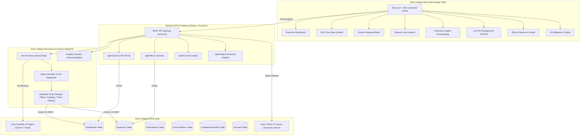

# ⚡ Karnataka State Police — Crime Intelligence & Predictive Command Platform
### *Powered Natively by the Zoho Catalyst Serverless Cloud Suite & QuickML AI Engine*

[](https://catalyst.zoho.com/)
[](https://catalyst.zoho.com/)
[](https://www.zoho.com/)
[](https://catalyst.zoho.com/)
[](https://catalyst.zoho.com/)
[](https://react.dev/)
[](https://tailwindcss.com/)
[](https://opensource.org/licenses/MIT)

---

## 📌 Executive Summary

An enterprise-grade, real-time **Law Enforcement Intelligence & Predictive Command Platform** engineered for the **Karnataka State Police (KSP)**. The platform is **100% built on top of the Zoho Catalyst Cloud Ecosystem**, utilizing **Catalyst Data Store**, **Serverless Functions**, **Zoho QuickML AI (GLM-4.7 Flash)**, and **Catalyst Web Client Edge Hosting**.

It seamlessly aggregates CCTNS (Crime and Criminal Tracking Network & Systems) records across Karnataka districts (Bengaluru, Mysuru, Hubballi-Dharwad, Mangaluru, Belagavi, etc.), providing commanding officers with real-time spatial GIS analytics, diurnal temporal matrices, criminal network link graphs, predictive crime forecasting, and an intelligent natural language AI copilot.

---

## 🏛️ How Zoho Catalyst Powers This Platform (5 Pillars)

```
                       +-------------------------------------------------------+
                       |             ZOHO CATALYST CLOUD SUITE                 |
                       +-------------------------------------------------------+
                                                   |
         +-------------------+---------------------+---------------------+-------------------+
         |                   |                     |                     |                   |
  [ Web Client ]      [ Datastore API ]   [ Serverless Functions ]  [ QuickML GLM AI ]   [ CLI & OAuth 2.0 ]
  Edge CDN Hosting    Relational Data      Node.js 18 Microservices  Predictive Copilot   Token Lifecycle
  (React 19 + Vite)   (CaseMaster, etc.)   (/api/chat, /insights)    (GLM-4.7 Engine)     Role-Based Auth
```

### 🗄️ 1. Zoho Catalyst Cloud Data Store (Core Persistence)
* **Full Relational CCTNS Schema**: Hosts active police FIR and intelligence records in the cloud across relational Catalyst Data Store tables (`CaseMaster`, `Employee`, `ComplainantDetails`, `PoliceStation`, `GravityOffence`, `Accused`, `FIRSubHeadMapping`).
* **Authenticated REST API Layer**: Direct CRUD repository ([`datastore.js`](datathon-chatbot/functions/chat/datastore.js)) performing authenticated operations via Catalyst REST endpoints (`/table/{table_name}/row`).
* **High-Resilience Dual-Layer Architecture**: Seamlessly persists user modifications to Catalyst Cloud Data Store with instant in-memory fallback for zero-latency operations during network interruptions.

### 🤖 2. Zoho QuickML AI Engine (GLM-4.7 Flash Copilot)
* **Natural Language CCTNS Intelligence**: Integrates directly with **Zoho QuickML** (`api.catalyst.zoho.in/quickml/v1/...`) for multi-turn natural language querying of state-wide crime databases.
* **Deterministic Intent Classification & Specialized Tools**: Routes queries dynamically to dedicated analytical tools (Hotspots, Officer Workload, Category Distribution, Trend Forecasting, District Ranking).
* **Predictive Anomaly & Risk Detection**: Evaluates historical crime velocity to calculate district vulnerability indices and auto-generate executive briefings.

### ⚡ 3. Zoho Catalyst Serverless Functions (Microservices)
* **`chat` Serverless Function**: Node.js 18 function ([`functions/chat`](datathon-chatbot/functions/chat)) serving AI copilot requests, intent routing, and real-time CCTNS data aggregation.
* **`insights` Serverless Function**: Node.js 18 function ([`functions/insights`](datathon-chatbot/functions/insights)) delivering predictive crime forecasting models, seasonal indicators, and statistical risk scores.
* **Standard Serverless Spec**: Fully configured with official `catalyst-config.json` specifications for serverless deployment.

### 🌐 4. Zoho Catalyst Web Client (Cloud Edge Hosting)
* **Edge CDN Deployment**: Deploys the unified React 19 + Vite command center frontend directly to Catalyst CDN edge infrastructure.
* **Zero-Downtime Pipeline**: Deployed with a single command via [`catalyst.json`](catalyst.json) and [`catalyst-config.json`](catalyst-config.json).

### 🔐 5. Zoho Catalyst OAuth 2.0 Security & Role-Based Access
* **Token Lifecycle Management**: Implements refresh-token authorization ([`catalyst_auth.js`](datathon-chatbot/functions/chat/catalyst_auth.js)) to manage fresh 1-hour access tokens from `accounts.zoho.in`.
* **Station & Officer PIN Authorization**: 4-digit PIN verification layer for sensitive database operations (FIR registration, record updates, status modifications, officer roster management).

---

## 🌟 Comprehensive Feature Suite

### 1. 🛡️ Executive Command Dashboard
* **Live Operational KPIs**: Real-time counters for Total Registered FIRs, Active Investigations, Chargesheet Rates, and Critical Incidents.
* **Crime Breakdown Analytics**: Visual distribution across Property Offences, Cyber Crime, Financial Fraud, Violent Offences, and Narcotics using interactive charts.
* **Live High-Gravity Stream**: Priority incident stream highlighting critical cases requiring immediate command intervention.
* **Quick Action Dispatch**: Instant access to FIR registration, copilot queries, and PDF briefing generation.

### 2. 🗺️ Interactive GIS Crime Map
* **Precinct & District Heatmaps**: Leaflet-based geospatial heatmap and cluster visualizer across all Karnataka police districts.
* **Severity-Based Visual Glows**: Color-coded markers for Critical (Red), High (Orange), and Medium (Blue) severity FIR cases.
* **District Intelligence Dossier**: Instant spatial metrics, case density, and station workloads upon clicking map pins or districts.

### 3. 🕒 Diurnal Crime Matrix (Temporal Analysis)
* **24-Hour Hour-by-Hour Distribution**: Pinpoint peak criminal activity time slices (e.g., late-night dacoity vs. afternoon cyber fraud).
* **Day-of-Week vs. Time Matrix**: Interactive heatmap highlighting high-risk tactical windows for intelligent patrol deployment and beat allocation.

### 4. 📈 Predictive Insights & AI Forecasting
* **Next-Cycle Crime Forecasting**: Time-series predictive models estimating next-month crime volumes and velocity per category.
* **District Vulnerability Index**: AI-computed risk scores based on historical recidivism, population density, and unresolved caseloads.
* **Early Anomaly Warnings**: Automated alerts for abnormal surges in specific crime heads (e.g., phishing syndicates, vehicle thefts).

### 5. 🕸️ Criminal Network & Link Analysis
* **Gang & Syndicate Graph**: Visual relationship graph linking suspects, co-accused entities, shared phone numbers, addresses, and vehicles.
* **Modus Operandi Correlation**: Correlate unsolved FIRs with known repeat offenders matching the same execution patterns.

### 6. 📋 Live Cloud FIR & Case Record Management
* **CCTNS-Compliant Registration**: 20+ structured fields (Crime Number, Police Station, Act & Section, Offence Severity, Complainant & Accused details, GPS Geolocation, Stolen/Recovered Property Value).
* **Live Cloud Synchronization**: Instant CRUD operations with validation, search, multi-filter queries, and live status updates (Under Investigation, Chargesheeted, Closed).

### 7. 👮 Officer Roster & Dossiers
* **Cloud Personnel Profiles**: Linked to the Catalyst `Employee` table with designation, badge number, station assignment, and contact details.
* **Workload & Clearance Tracking**: Real-time tracking of active caseloads, resolution rates, and performance recognition (Officer of the Month).
* **Administrative Security**: Officer access control, credential management, and role-based permissions.

### 8. 🤖 AI Intelligence Copilot (Zoho QuickML)
* **Natural Language Queries**: Ask questions in plain English (*"Show top cybercrime hotspots in Bengaluru"*, *"Which officer has the highest pending workload in Mysuru?"*).
* **Automated Senior Officer Briefings**: One-click generation of comprehensive, executive-ready crime summaries and risk briefings.

### 9. 📄 Automated Intelligence Reports & Export
* **Audit-Ready Reports**: Print-ready, structured operational briefs.
* **Data Export**: Export filtered case records in JSON / CSV formats for external CCTNS reporting.

---

## 🏗️ System Architecture



---

## 🛠️ Technology Stack

| Layer | Technology | Version / Spec | Purpose |
|:---|:---|:---|:---|
| **Cloud Platform** | **Zoho Catalyst** | Cloud Suite | Complete serverless backend, datastore, AI, and hosting |
| **Cloud Database** | **Catalyst Data Store** | Relational NoSQL/SQL | Persistence for FIRs, officers, stations, and complainants |
| **AI / Machine Learning** | **Zoho QuickML** | GLM-4.7 Flash | Natural language reasoning, intent routing, copilot queries |
| **Serverless Functions** | **Catalyst Functions** | Node.js 18 | Scalable microservices (`chat`, `insights`) |
| **Frontend Framework** | **React** | v19.2 | High-performance reactive user interface |
| **Build & Tooling** | **Vite** | v8.1 | Blazing fast client bundling and HMR |
| **Styling & Design** | **Tailwind CSS** | v4.3 | Tactical dark-mode command center design system |
| **GIS Mapping** | **Leaflet & React-Leaflet** | v1.9 / v5.0 | Geospatial crime mapping, pin clustering, severity heatmaps |
| **Data Visualizations** | **Recharts** | v3.9 | Temporal trends, category distributions, risk gauges |
| **Animations** | **Framer Motion** | v12.4 | Smooth modal transitions, micro-interactions, alert glow effects |
| **Icons** | **React Icons** | v5.7 | Lucide, Feather, and FontAwesome icon sets |

---

## 🗄️ Zoho Catalyst Data Store Relational Schema

| Table Name | Primary Keys & Key Attributes | Role in Platform |
|:---|:---|:---|
| **`CaseMaster`** | `ROWID`, `CaseMasterID`, `CrimeNo`, `CaseNo`, `CrimeRegisteredDate`, `PoliceStationID`, `GravityOffenceID`, `BriefFacts`, `latitude`, `longitude`, `ActSection` | Central repository for all registered FIRs and police cases |
| **`Employee`** | `ROWID`, `EmployeeID`, `EmpName`, `Rank`, `StationID`, `Email`, `Role`, `ActiveCases`, `ResolvedCases` | Officer profiles, ranks, credentials, and workload metrics |
| **`PoliceStation`** | `ROWID`, `PoliceStationID`, `UnitName`, `District`, `Zone`, `StationHead`, `Latitude`, `Longitude` | Jurisdictional precinct mapping and station metadata |
| **`GravityOffence`** | `ROWID`, `GravityOffenceID`, `OffenceType`, `SeverityLevel`, `IPC_Sections` | Severity classification mapping (Critical / High / Medium / Low) |
| **`ComplainantDetails`** | `ROWID`, `ComplainantID`, `CaseMasterID`, `ComplainantName`, `AgeYear`, `Gender`, `ContactNumber` | Citizen complainant record storage |
| **`Accused`** | `ROWID`, `AccusedMasterID`, `CaseMasterID`, `AccusedName`, `Status`, `PriorConvictions` | Suspect entity tracking and criminal graph linkage |

---

## 🔌 API Reference

### 1. Crime Records & FIRs (`/api/records`)
* `GET /api/records` — Retrieve all FIR records with optional query filtering (`district`, `category`, `severity`, `status`, `search`).
* `POST /api/records` — Register a new FIR record directly to the Catalyst Data Store.
* `PUT /api/records/:id` — Update case status, facts, or assigned officer.
* `DELETE /api/records/:id` — Archive/delete a case record (requires PIN authorization).

### 2. Officer Roster (`/api/officers`)
* `GET /api/officers` — Retrieve officer profiles, active case assignments, and clearance rates.
* `POST /api/officers` — Add a new law enforcement officer to the roster.

### 3. AI Copilot & Natural Language (`/api/chat`)
* `POST /api/chat`
  * **Payload**: `{ "message": "Show high risk cyber crime areas in Bengaluru", "history": [...] }`
  * **Response**: Natural language analytical response with structured data tables, metric summaries, and action recommendations.

### 4. Predictive Insights & Forecasting (`/api/insights`)
* `GET /api/insights` — Returns statistical forecasts, district risk indices, time-series projections, and category velocity metrics.

---

## 🚀 Getting Started & Local Development

### Prerequisites
* **Node.js** (v18.0.0 or higher)
* **npm** (v9.0.0 or higher)
* *(Optional)* **Zoho Catalyst CLI** (`npm install -g zcatalyst-cli`)

### 1. Clone the Repository
```bash
git clone https://github.com/m-agrawal09/ksp-crime-intelligence-platform.git
cd ksp-crime-intelligence-platform
```

### 2. Install Dependencies
Install dependencies for both root backend gateway and the frontend:
```bash
# Install root backend dependencies
npm install

# Install frontend dependencies
cd frontend && npm install && cd ..
```

### 3. Configure Environment Variables
Copy `.env.example` to `.env` in the root directory:
```bash
cp .env.example .env
```

Review or configure your credentials in `.env`:
```env
PORT=3000
QUICKML_ENDPOINT=https://api.catalyst.zoho.in/quickml/v1/project/<PROJECT_ID>/glm/chat
QUICKML_ACCESS_TOKEN=<YOUR_QUICKML_ACCESS_TOKEN>
CATALYST_ORG_ID=<YOUR_CATALYST_ORG_ID>
```

### 4. Run the Application

#### Option A: Unified Full-Stack Server (Recommended)
Builds the frontend and runs the unified local Catalyst gateway:
```bash
npm run build
npm start
```
Open **[http://localhost:3000](http://localhost:3000)** in your browser.

#### Option B: Independent Development Mode (Hot Reload)
Run the backend gateway and Vite frontend development server concurrently:
```bash
# Terminal 1: Start backend gateway (Port 3000)
npm run dev:backend

# Terminal 2: Start frontend Vite server (Port 5173 with HMR)
npm run dev:frontend
```

---

## ☁️ Deployment

### 1. Deploying to Zoho Catalyst Cloud (Native Serverless)
The repository is pre-configured with root [`catalyst.json`](catalyst.json) and function [`catalyst-config.json`](datathon-chatbot/functions/chat/catalyst-config.json) manifests.

```bash
# 1. Login to Catalyst
catalyst login

# 2. Build the production client bundle
cd frontend && npm run build && cd ..

# 3. Associate with your Catalyst project ID
catalyst project:use <YOUR_PROJECT_ID>

# 4. Deploy full serverless stack (Functions + Web Client + Data Store)
catalyst deploy
```

### 2. Deploying to Render / Cloud PaaS
This repository includes a native [`render.yaml`](render.yaml) specification:
1. Connect your GitHub repository to [Render](https://render.com/).
2. Create a new **Web Service** from Blueprint.
3. Configure the environment variables (`QUICKML_ENDPOINT`, `QUICKML_ACCESS_TOKEN`, `CATALYST_ORG_ID`).
4. Render will automatically execute `npm run build` and `npm start`.

---

## 📁 Repository Structure

```
ksp-crime-intelligence-platform/
├── .catalystrc                          # Catalyst runtime configuration
├── .env.example                         # Example environment variables
├── app-sail.json                        # Catalyst AppSail configuration
├── catalyst.json                        # Catalyst project deployment manifest
├── package.json                         # Root backend package configuration
├── render.yaml                          # Render Cloud deployment blueprint
├── server.js                            # Unified Node.js API Gateway & Static Server
│
├── datathon-chatbot/                    # Catalyst Serverless Functions
│   └── functions/
│       ├── chat/                        # AI Copilot & Data Store Integration
│       │   ├── datastore.js             # Catalyst Data Store CRUD repository
│       │   ├── quickml.js               # Zoho QuickML GLM-4.7 API client
│       │   ├── intent.js                # Deterministic intent parser
│       │   ├── router.js                # Chat command router
│       │   ├── catalyst-config.json     # Catalyst function config
│       │   └── tools/                   # Analytical tools (hotspot, officer, etc.)
│       └── insights/                    # Predictive Crime Analytics Microservice
│           ├── index.js                 # Forecasting & anomaly logic
│           └── catalyst-config.json     # Catalyst function config
│
├── frontend/                            # React 19 + Vite Web Client
│   ├── index.html                       # Application entry point
│   ├── package.json                     # Frontend dependencies
│   ├── vite.config.js                   # Vite bundler configuration
│   └── src/
│       ├── App.jsx                      # Main application component
│       ├── index.css                    # Tailwind CSS v4 design system
│       ├── components/                  # Reusable UI components
│       │   ├── dashboard/               # KPI cards, charts, live incident stream
│       │   ├── layout/                  # Navigation, Sidebar, Notifications
│       │   ├── map/                     # Leaflet GIS crime map components
│       │   ├── officers/                # Officer cards, modals, workload meters
│       │   └── records/                 # FIR form modals, filter bars, tables
│       ├── pages/                       # Application Pages
│       │   ├── Dashboard/               # Executive intelligence dashboard
│       │   ├── CrimeMap/                # Interactive GIS spatial map
│       │   ├── DiurnalMatrix/           # 24-hour temporal crime matrix
│       │   ├── InsightsForecast/        # Predictive crime analytics & risk
│       │   ├── NetworkAnalysis/         # Criminal link graph & gang analysis
│       │   ├── ManageRecords/           # Live CCTNS FIR management (CRUD)
│       │   ├── Officers/                # Personnel roster & performance
│       │   ├── Reports/                 # Intelligence briefing reports & export
│       │   ├── Settings/                # System config & Catalyst cloud health
│       │   └── Login/                   # Officer authentication & PIN gate
│       └── services/                    # Frontend API clients & store wrappers
│
└── scripts/                             # Cloud database seeding & migration tools
    ├── seed_catalyst_proper.js          # Master seed script for Catalyst Data Store
    ├── bootstrap_cloud_master_data.js   # Bootstrap reference master tables
    └── generate_200_firs.js             # Synthetic CCTNS test data generator
```

---

## 🏆 Hackathon & Technical Highlights

1. **Native Zoho Catalyst Full-Stack Utilization**:
   Every layer of the platform leverages Zoho Catalyst—from **Cloud Data Store** relational tables to **Node.js 18 Serverless Functions**, **QuickML GLM-4.7 Flash AI**, **OAuth 2.0 Auth**, and **Edge Web Client Hosting**.
2. **Real-World Law Enforcement Utility**:
   Directly addresses core operational challenges faced by police departments: identifying emerging crime clusters, predicting high-risk temporal windows, tracking officer caseload equity, and discovering hidden syndicate relationships.
3. **Enterprise Reliability & Performance**:
   Combines real-time cloud data persistence with in-memory caching for sub-100ms response times, 4-digit PIN access security, and full responsive design optimized for mobile patrol units and precinct command walls alike.

---

## 📄 License & Attribution

This project is licensed under the **MIT License**. Developed for the **Karnataka State Police Crime Intelligence Initiative** powered by **Zoho Catalyst**.